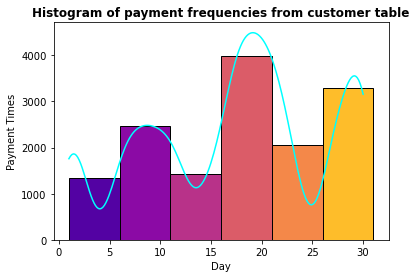

# Sakila DVD Rental Database using SQL, Python with Data Visualization 
## Description
The DVD rental database represents the business processes of a DVD rental store. The DVD rental database has many objects, including: 15 tables, 1 trigger, 7 views, 8 functions, 1 domain, 13 sequences.

This project includes 4 major modules to analyze several business analysis questions and visualization both in PostgresSQL and Python such as: How can you produce a list of members who joined after a specific time range and location (with multiple constraints)? What is the top 10 most productive actors by their total amount of films in the last 5 year? what time range customers spend the most money?

## Getting Started

### Dependencies

* [PostgreSQL](https://postgresapp.com/)
* [pgAdmin 4](https://www.pgadmin.org/download/)
* Python: psycopg2 library

### Module 1
* Applied basic SQL operations on PostgreSQL such as
```
SELECT,  DISTINCT,  COUNT(), WHERE, ORDER BY , BETWEEN, IN, LIKE, ILIKE ...
```

For example, we want to know What customer has the highest customer ID number whose name starts with an 'E' and has an address ID lower than 500?

```
SELECT first_name,last_name FROM customer
WHERE first_name LIKE 'E%'
AND address_id <500
ORDER BY customer_id DESC
LIMIT 1;
```
Other questions please check my sql file

### Module 2
* Applied Advanced SQL commands: 

1.	JOIN : INNER JOIN, LEFT OUTER JOIN, RIGHT OUTER JOIN;  AS, UNION,
2.	Timestamps and Extraction: TIME, DATE, TIMESTAMP, TIMESTAMPTZ; EXTRACT(), AGE(), TO_CHAR()
3.	Math func, min(), max(), avg(), sum()
4.	String func
5.	Sub-query: The subquery is performed first since it is inside the parenthesis. We can also use the IN operator in conjunction with a subquery to check against multiple results returned
6.  SELF JOIN: A query in which a table is joined to itself. Self-joins are useful for comparing values in a column of rows within the same table

For instance, California sales tax laws have changed and we need to alert our customers to this through email. What are the emails of the customers who live in California?


```
SELECT district,email FROM address 
INNER JOIN customer 
ON address.address_id = customer.address_id 
WHERE district = ''California';
```
### Module 3
* Creating database and table by CREATE, UPDATE, REVIEW, DELETE , ALTER TABLE and import export csv data
or using Conditional expression and procedures including:
```
CASE, COALESCE, CAST, NULLIF, VIEWS ...
```

For example, creating a new table:

```
CREATE TABLE students(
student_id serial PRIMARY KEY,
first_name VARCHAR(45) NOT NULL,
last_name VARCHAR(45) NOT NULL, 
homeroom_number integer,
phone VARCHAR(20) UNIQUE NOT NULL,
email VARCHAR(115) UNIQUE,
grad_year integer);
```

### Module 4
* PostGreSQL with Python libaray psycopg2:

Psycopg 2 is mostly implemented in C as a libpq wrapper, resulting in being both efficient and secure. It features client-side and server-side cursors, asynchronous communication and notifications, “COPY TO/COPY FROM” support. Many Python types are supported out-of-the-box and adapted to matching PostgreSQL data types; adaptation can be extended and customized thanks to a flexible objects adaptation system.

Here I show simple code how to create a cursor and please check details in .py file

```
import psycopg2 as pg2

#Making the initial connection:
secret = 'my_password'
#conn = pg2.connect(database='dvdrental',user='postgres', password=secret)
try:
    conn = pg2.connect(database='dvdrental', user='postgres', host='localhost', password=secret)
except:
    print ("I am unable to connect to the database")

##define a cursor to work with
cur = conn.cursor()

##we can execute a query: pass any string operations of SQL in Python
cur.execute('SELECT * FROM payment')
```

Besides, I also visualize my sql result such as histogram, line plot, and other charts to better undestand results. 
For example, at what range of a month, people shop frequetly in months? From my histgram plot, we can find that durig mid month and end of month, customers pay at most times which is reasonable deu to salary payment periodicly. 



## Authors

* [Qiaoji Xu](https://www.linkedin.com/in/qiaoji-lim-xu-53156b245/)
* limqiaojixu@gmail.com

## License

to be updated

## Acknowledgments
Inspiration, code snippets, etc.
* [psycopg2](https://pypi.org/project/psycopg2/)
* [database](https://www.postgresqltutorial.com/postgresql-getting-started/postgresql-sample-database/)

